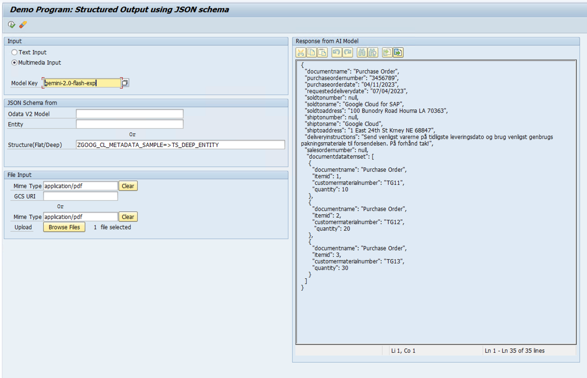

#  Google Cloud Generative AI Samples for SAP

[Vertex AI](https://cloud.google.com/vertex-ai) is a fully-managed, unified AI development platform for building and using generative AI. For developing Generative applications in SAP system, Google Cloud offers [Vertex AI SDK for ABAP](https://cloud.google.com/solutions/sap/docs/abap-sdk/vertex-ai-sdk/latest/overview) that can be installed in any SAP ERP system and BTP ABAP Environment. 

This repository contains code samples, sample apps, and other resources that demonstrate how to use, develop and manage generative AI applications in your SAP environment by using Vertex AI SDK for ABAP.

## Prerequisite
In order to use these sample applications in your systems, you first need to [Install and Configure](https://cloud.google.com/solutions/sap/docs/abap-sdk/vertex-ai-sdk/latest/install-configure-vertex-ai-sdk-abap) Vertex AI SDK for ABAP. Please note the Model Key from the [configure model parameters](https://cloud.google.com/solutions/sap/docs/abap-sdk/vertex-ai-sdk/latest/install-configure-vertex-ai-sdk-abap#configure-model-generation-parameters) step - which you will use as an input in the below samples

## NL 2 SQL
You can use the program ZGOOG_R_DEMO_NL2SQL to dynamically generate SQL statement for natural language queries. The AI model will use the CDS view definition to map users natural language query to corresponding where clauses in SQL statement. Below is a sample output for query on Products table 

By using the approach demonstrated in this sample, you can build your own AI powered Fiori chatbot for your SAP business application. 

## Structured Output
You can use the program ZGOOG_R_DEMO_STRUCT_OUTPUT to generate a generate structured output conforming to a JSON schema for unstructured inputs such as text and PDF. You can specify an OData Entity or any structure (flat / deep) to which the JSON output should be mapped or transformed. 

